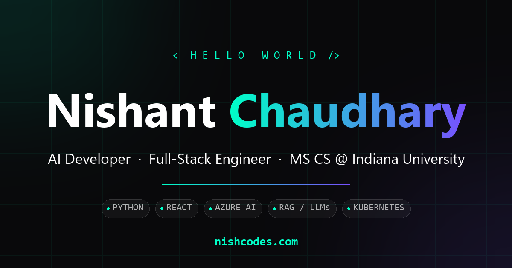

<div align="center">



# nishcodes.com

**A portfolio that behaves like a terminal, not a brochure.**

Interactive React portfolio with a command palette, a hidden shell, a 3D-lit
experience timeline, a self-drawing signature, and a serverless visitor
notifier that emails me the first time someone new opens the site.

[](https://nishcodes.com)
&nbsp;


</div>

---

## What this is

My personal site. Most portfolios are a scroll and a PDF link - this one
rewards poking at it. There's a command palette, a working terminal with a
recruiter easter egg, a cursor that drags a comet trail through a particle
field, and a signature that writes itself.

Underneath the theatre it's a single-page React app deployed as static files to
GitHub Pages, plus one small Cloudflare Worker doing the only thing static
hosting can't.

**→ [nishcodes.com](https://nishcodes.com)**

---

## Highlights

| | |
|---|---|
| **⌘/Ctrl + K** | Command palette - open the terminal, jump to any section, or reach the résumé, GitHub, LinkedIn, email, and the motion toggle. Arrow keys and `esc` behave the way you'd expect, and the `esc` chip is clickable. |
| **`` ` `` key** | A real terminal. `help`, `whoami`, `about`, `projects`, `experience`, `skills`, `education`, `contact`, `resume`, `github`, `linkedin`, `theme`, `motion`, `date`, `goto <section>`, `clear`, `exit` - and `sudo hire-me`. |
| **Self-drawing signature** | A hand-authored SVG path that writes "Nishant Chaudhary" stroke by stroke, with a glowing pen tip leading the ink. |
| **3D experience timeline** | Per-role `@react-three/fiber` visuals that sit alongside each job on desktop. |
| **Interactive background** | Canvas particle field with a cursor glow, comet trail, and click ripples. |
| **Visitor notifier** | A Cloudflare Worker that emails me once per unique visitor. [Details below.](#the-visitor-notifier) |
| **Motion toggle** | One control pauses *every* animation on the page - background, signature, glows. Nothing is hard-coded to move. |
| **Light & dark** | Both themes are complete. Toggle via the terminal's `theme` command. |

---

## The signature

The nicest bit of engineering on the page, and the least obvious.

It's not a font. It's a hand-authored cubic-bézier path in three strokes -
`Nishant`, the dot on the `i`, then `Chaudhary` - revealed with
`stroke-dashoffset` while a glowing dot rides the same path via `animateMotion`.

Two things that make it work:

- **`stroke-dasharray` restarts at every subpath.** One path element holding all
  three strokes reveals them *simultaneously*, each from its own start. So each
  stroke is its own `<path>`, and each gets a slice of the write window sized by
  its measured length - which is also what keeps the pen at a constant speed
  across the pen lifts.
- **A `moveto` contributes zero path length.** So the travelling pen tip
  *teleports* between strokes instead of sliding across the gap. That's exactly
  what lifting a pen looks like.

Cycle is 4.8s writing, 2s held, then a fade. With animations paused it renders
as a complete static signature - no dash, no pen tip.

---

## The visitor notifier

GitHub Pages is static: no server, no logs, no request data. So the site pings a
Cloudflare Worker on load, and the Worker emails me the **first** time it sees
someone. Repeat visits are silent.

```
  Browser  ──POST──▶  Cloudflare Worker  ──▶  Workers KV   (seen before?)
                             │
                             └──▶  Resend  ──▶  inbox
```

Each email carries approximate city/region/country, the network operator, a
masked IP, browser/OS/device, the page, the referrer, a timestamp, and a running
count of unique visitors.

**On privacy.** The dedupe key is a salted SHA-256 of IP + user-agent, so no raw
IP address is ever written to storage. The email shows the address with its host
portion masked (`203.0.113.•••`) - enough to be useful, not enough to identify.
Crawlers and link unfurlers are filtered by user-agent, so Slack previews and
Googlebot don't trigger anything. CORS is locked to the site's own origins.

**On accuracy.** Uniqueness is approximate by nature - mobile carriers put many
people behind one IP, home IPs rotate, and ad blockers will stop some pings
entirely. It's a signal, not analytics.

Full setup lives in [`visitor-worker/README.md`](visitor-worker/README.md).
Secrets are Wrangler secrets, never committed.

---

## Stack

**Frontend** - React 19 · Create React App · Three.js via `@react-three/fiber`
and `drei` · `react-icons` · inline styles with a theme context (no CSS
framework)

**Edge** - Cloudflare Workers · Workers KV · Resend

**Deploy** - GitHub Actions → GitHub Pages, custom domain

---

## Layout

```
src/
  App.js                    the site - sections, palette, terminal, signature
  components/
    ExperienceVisuals.jsx   3D visuals per role
    ThemedIcons.jsx         theme-aware SVG icons
  visitorPing.js            one fetch to the worker, once per browser
visitor-worker/
  src/index.js              geo lookup, dedupe, email
  wrangler.toml             config (no secrets)
.github/workflows/main.yml  build + deploy to Pages
```

`App.js` is deliberately one large file - a single-page site with shared theme
and motion state, where splitting it would mean threading context through a
dozen modules for no real gain.

---

## Running it

```bash
npm install && npm start
```

Opens on `http://localhost:3000`. The visitor ping is disabled on localhost, so
local runs never send email.

| Script | |
|---|---|
| `npm start` | dev server with hot reload |
| `npm run build` | production bundle to `build/` |
| `npm run deploy` | manual publish via `gh-pages` |
| `npm test` | CRA test runner - currently only the unmodified starter test |

Requires Node 18+.

---

## Deploying

Pushing to `master` triggers [`.github/workflows/main.yml`](.github/workflows/main.yml),
which builds and publishes to GitHub Pages.

The Worker deploys separately and only when its own code changes:

```bash
cd visitor-worker && npx wrangler deploy
```

---

<div align="center">

**Nishant Chaudhary** - MS Computer Science, Indiana University Bloomington

[Website](https://nishcodes.com) · [LinkedIn](https://www.linkedin.com/in/nishant-nishcodes/) · [GitHub](https://github.com/Nishant2306) · nishantchaudhary0512@gmail.com

<sub>MIT licensed. Content and résumé are mine - the code is yours to learn from.</sub>

</div>
